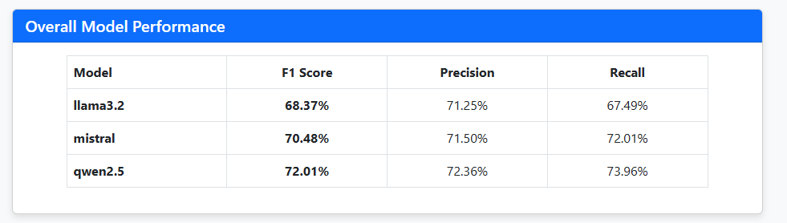
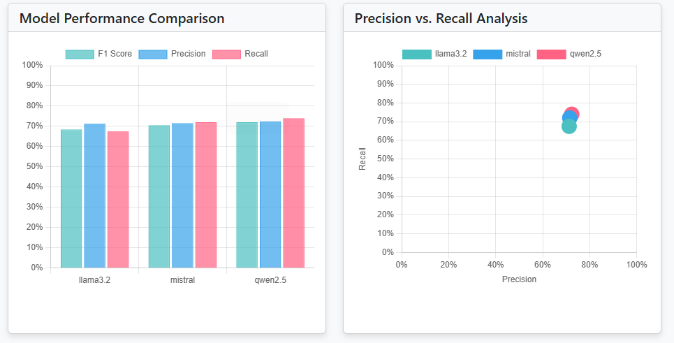
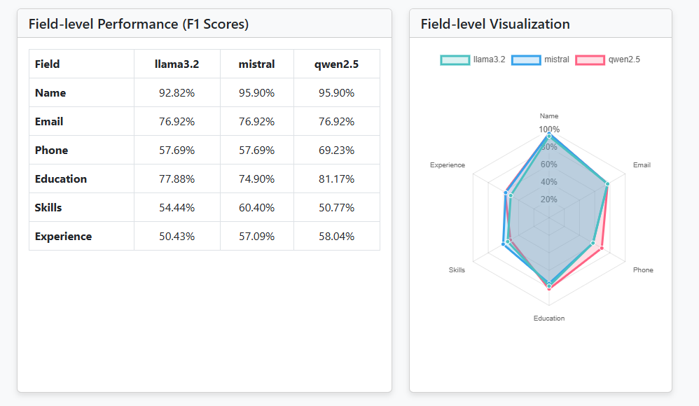

# CV Extractor with Open-Source LLMs
Demo Link :https://www.youtube.com/watch?v=I7RZ_8iWOPw
This project implements an intelligent resume parsing system that extracts structured information from CVs using open-source large language models (LLMs) via Ollama. The solution handles both text-based and scanned PDFs through dedicated processors, with OCR capability for image-based documents.
The system integrates three models (llama3.2, mistral, and qwen2.5) to extract key information like contact details, education, experience, and skills. A comprehensive evaluation framework compares extraction accuracy across models using precision, recall, and F1 metrics against labeled ground truth data.
The implementation features a clean, modular architecture with separate components for data processing, model integration, and evaluation. A web interface allows users to upload CVs and view extracted information alongside performance metrics. The solution is well-documented with clear setup instructions for local deployment.

Project Structure

├───comparisons

├───CVs

│   ├───img_pdf

│   └───text_pdf

├───data

│   ├───ground_truth

│   └───results

├───evaluator

├───models

├───processors

├───results

├───templates

└───uploads

## Directory Descriptions
## comparisons
Stores files or scripts for comparing results, models, or data outputs. This directory may contain comparison reports, visualizations, or scripts for analyzing differences between datasets or model predictions.

## CVs
Contains CV-related data, split into two subdirectories:

img_pdf: Stores CVs in image-based PDF format or images extracted from CVs.
text_pdf: Stores CVs in text-based PDF format or text extracted from CVs.
This directory is likely used for processing or analyzing CV documents.

## data
Organizes datasets used in the project:

ground_truth: Contains reference data or annotations used for evaluation (labeled CV data).
results: Stores output data generated by the project ( model predictions).

## evaluator
## Evaluation Metrics (evaluation_metrics.py)
The evaluation_metrics.py script evaluates the performance of CV data extraction by comparing extracted data to ground truth. It calculates precision, recall, F1 score, and similarity for fields like name, email, phone, education, skills, and experience. It processes multiple models, computes metrics for each CV, and provides a summary of average performance across all CVs.

## models
### Ollama Client (ollama_client.py)

The ollama_client.py script defines the OllamaClient class and a helper function to interact with an Ollama model API. It generates responses from a specified model and extracts structured data (e.g., name, email, education, skills, experience) from CV text in JSON format. The helper function parses JSON responses, handling formatting issues

## processor
### PDF Processor 
The PDFProcessor class handles text-based PDFs. It checks if a PDF contains extractable text by analyzing the first few pages and extracts all text from the PDF, returning it as a single string.
### OCR Processor 
The OCRProcessor class extracts text from scanned PDFs by applying OCR. It processes PDFs by rendering pages as images or extracting embedded images, then converts them to text. Returns all extracted text as a single string.

## results
Stores final or intermediate results generated by the project, such as processed CVs, model outputs, or evaluation metrics.

## templates
The templates folder contains HTML files that define the front-end interface of the project. These templates are used by a web framework (e.g., Flask or Django) to render dynamic web pages, such as forms for uploading CVs, displaying extracted data, or visualizing evaluation results.

## uploads
Stores user-uploaded files.

## Steps

### Clone the Project
git clone https://github.com/STAAHMED11/CV_extractor
cd CV_extractor

### Set Up the Python Virtual Environment:
### Install Dependencies:
### Install project dependencies for each environment.
 pip install -r requirements.txt
## install the LLMs
install ollama in your computer
install the models from ollama

### for this project
ollama pull llama3.2
ollama pull mistral
ollama pull qwen2.5

## Run the Project:
python app.py 
## Access the Web Interface
navigate to http://localhost:5000 (or the specified port) in your browser after running the application.

# Evaluation 

